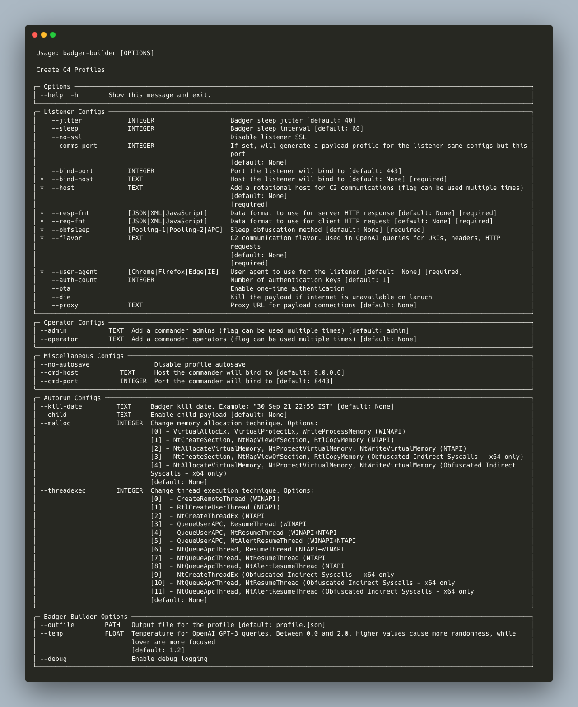

<h1 align="center">
<br>

<br>
badger-builder
</h1>

`badger-builder` is an AI-assisted tool for generating dynamic Brute Ratel C4 profiles. Simply provide `badger-builder` a *flavor* for your desired profile and it will prompt OpenAI for fitting configurations.

Listener/payload profile configs that are AI generated:
- C2 URIs
- Request/response HTTP headers
- HTTP body data prepended and appended to C2 requests/responses
- The server's *empty-response* HTTP body

HTTP body data can be generated in XML, JSON or JavaScript (and request format can differ from response format).

It's recommended to always review the configs generated by OpenAI, especially for cases where it failed to avoid usage of test/sample/placeholder values. The AI generated configs are generally a good starting point, but you may want to make some modifications to fit your ideal traffic profile.

Tested with Brute Ratel 1.4.5

Currently only HTTP listener profile configs are supported (no DoH support)

### Note on OpenAI Usage
The prompts `badger-builder` sends to the OpenAI API consume [tokens](https://help.openai.com/en/articles/4936856-what-are-tokens-and-how-to-count-them). Usage generally consumes a thousand tokens (< $0.05 USD). Your OpenAI account must either be on the free trial or have setup API billing. (Check your usage and billing [here](https://platform.openai.com/account/usage))

## Install
`badger-builder` can be installed by cloning this repository and running `pip3 install .` and subsequently executed from PATH with `badger-builder`

## Usage

## Examples

## Development
`badger-builder` uses Poetry to manage dependencies. Install from source and setup for development with:
```
git clone https://github.com/tw1sm/badger-builder
cd badger-builder
poetry install
poetry run badger-builder --help
```

## Improvements
- [ ] Better OpenAI prompts
- [ ] DoH listener integration
- [ ] More prepend/append data formats
- [x] `autorun` actions such as setting kill date, chid, malloc/threadex settings